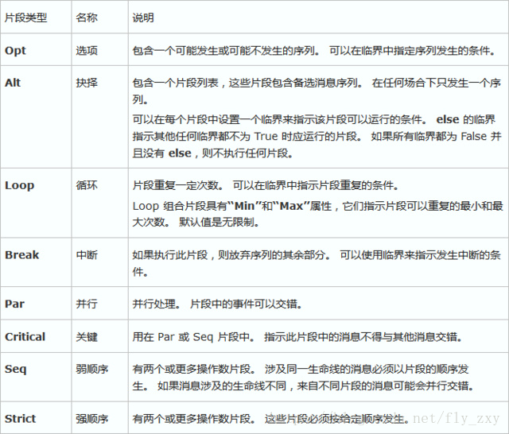
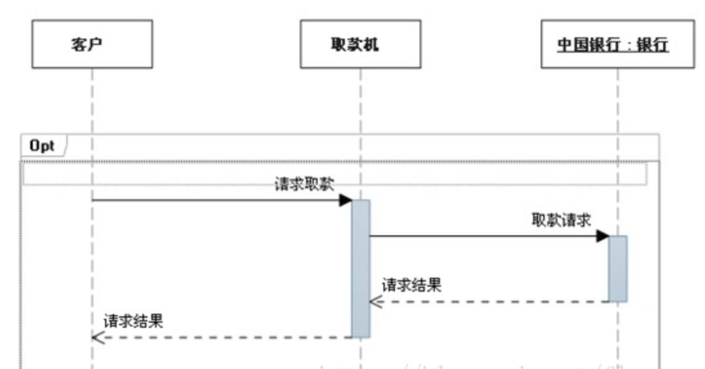

## UML时序图(Sequence Diagram)


### 1、什么是时序图

时序图(Sequence Diagram)，又名序列图、循序图，是一种UML交互图。它通过描述对象之间发送消息的时间顺序显示多个对象之间的动态协作。

让我们来看一看visio2016对时序图的的解释。

### 2、时序图的元素

我们在画时序图时会涉及7种元素：**角色(Actor)**、**对象(Object)**、**生命线(LifeLine)**、**控制焦点(Activation)**、**消息(Message)**、**自关联消息**、**组合片段**。其中前6种是比较常用和重要的元素，剩余的一种组合片段元素不是很常用，但是比较复杂。我们先介绍前6种元素，在单独介绍组合片段元素。

#### 角色(Actor)

系统角色，可以是人或者其他系统，子系统。以一个小人图标表示。 

#### 对象(Object)

对象位于时序图的顶部,以一个矩形表示。对象的命名方式一般有三种： 

* 对象名和类名。例如：华为手机:手机、loginServiceObject:LoginService。 
* 只显示类名，不显示对象，即为一个匿名类。例如：:手机、:LoginSservice。 
* 只显示对象名，不显示类名。例如：华为手机:、loginServiceObject:。 

#### 生命线(LifeLine)

时序图中每个对象和底部中心都有一条垂直的虚线，这就是对象的生命线(对象的时间线)。以一条垂直的虚线表。 
控制焦点(Activation)

控制焦点代表时序图中在对象时间线上某段时期执行的操作。以一个很窄的矩形表示。 

#### 消息(Message)

表现代表对象之间发送的信息。消息分为三种类型。 
    

**（1）同步消息(Synchronous Message)**

消息的发送者把控制传递给消息的接收者，然后停止活动，等待消息的接收者放弃或者返回控制。用来表示同步的意义。以一条实线+实心箭头表示。 
    

**（2）异步消息(Asynchronous Message)**

消息发送者通过消息把信号传递给消息的接收者，然后继续自己的活动，不等待接受者返回消息或者控制。异步消息的接收者和发送者是并发工作的。以一条实线+大于号表示。 
    

**（3）返回消息(Return Message)**

返回消息表示从过程调用返回。以小于号+虚线表示。 

#### 自关联消息

表示方法的自身调用或者一个对象内的一个方法调用另外一个方法。以一个半闭合的长方形+下方实心剪头表示。

我们来使用Visio2016来画一个用户打开微信扫描二维码支付流程时序图，通过这个时序图来认识刚刚介绍的6种时序图元素。


时序图解释：

```text
1 用户输入手机密码
2 打开手机
3 打开微信扫一扫
4 返回微信扫一扫界面
5.1 扫描商家收款码
5.2 商家生成收款二维码
5.3 返回收款二维码
5.4 识别商家收款码
6 提示用户输入微信支付密码
7.1 输入微信支付密码
7.2 微信验证用户输入密码正确
7.3 向商家汇款
7.4 汇款成功
8 提示用户支付成功
```


#### 组合片段

组合片段用来解决交互执行的条件和方式，它允许在序列图中直接表示逻辑组件，用于通过指定条件或子进程的应用区域，为任何生命线的任何部分定义特殊条件和子进程。组合片段共有13种，名称及含义如下：

 


**常用组合片段举例**

**（1）抉择（Alt）**

**抉择在任何场合下只发生一个序列。 可以在每个片段中设置一个临界来指示该片段可以运行的条件**。else 的临界指示其他任何临界都不为 True 时应运行的片段。如果所有临界都为 False 并且没有 else，则不执行任何片段。Alt片段组合可以理解为if..else if...else条件语句。

我们还拿微信支付的时序图举例，如果7.3向商家汇款的成功或失败流程需要在时序图中体现出来，可以这么使用Alt片段组合。


**（2）选项（Opt）**

**包含一个可能发生或不发生的序列。Opt相当于`if`语句**。




**（3）循环（Loop）**

**片段重复一定次数，可以在临界中指示片段重复的条件。Loop相当于`for`语句。**


**（4）并行（Par）**

**并行处理，片段中的事件可以并行交错。Par相当于多线程**。


### 3、时序图的绘制工具

* **微软visio** ：非常强大且专业的一个画工具，支持UML/E-R图/流程图等各种图形的绘制，而且还可以直接在Word文档中引入，对于写论文等专业性比较高文档推荐使用
* **ProcessOn**：一个在线画图工具，支持UML/E-R图/流程图/思维导图等各种图形的绘制，缺点是收费的，目前免费文件数只有9个，超过之后就需要续费扩容，否则就得吧之前的文件删除一些

......还有很多，以上2款是我日常使用最多的画图工具


### 4、练习事例

#### 时序图的绘制步骤

时序图的绘制步骤可以总结为：

**1 、划清边界，识别交互语境**

所谓划清边界是是指要确定好绘制时序图的范围。在微信支付例子中省略列商家打开微信、输入收款金额等交互消息，这些不是我们需要体现的，我们主要体现的是用户的扫码支付流程。

所谓识别交互语境就是要知道自己绘制时序图的前提和背景。在微信支付的例子中用户登录了微信、开通了支付功能是前提，背景是用户需要扫描付款买东西。

**2、梳理时序图中的角色和对象都有哪些**

微信支付的例子中角色只有一个，即用户。对象有华为手机：手机、安卓版微信：微信、：商家。

**3、对象之间有哪些交互消息** 

对象之间交互的消息详见以上时序图。

#### 时序图的绘制技巧

时序图的绘制技巧：

1、从初始消息开始画，依次画出随后消息，并给每个消息分配序号，方便理解。

2、角色和对象用名词，消息用动词。

3、角色放在时序图的开始位置，对象重要程度或使用频率从左到右排列。这就要根据时间的流程考虑了，是一个比较主观的事情。

4、激活条两端要以消息元素封顶，激活条不要超过消息元素。

以常见的用户登陆流程为为例，用户登录系统时序图如下。


### 参考

[1] [UML时序图(Sequence Diagram)学习笔记](https://blog.csdn.net/fly_zxy/article/details/80911942)

