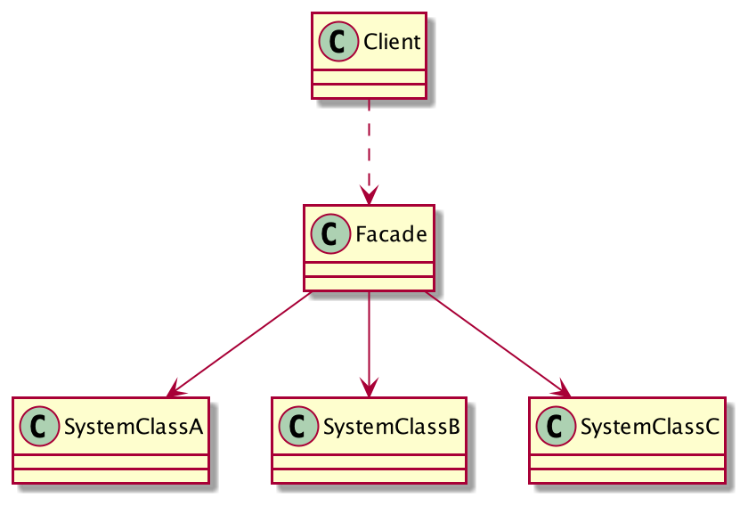

### 门面模式(Facade Pattern)


### 一、门面模式的定义

门面模式也叫做外观模式，是一种常见的封装模式，它的定义：要求一个子系统的外部与其内部的通信必须通过一个统一的对象进行。门面模式提供一个高层次的接口，使子系统更容易使用。

### 二、门面模式的优点

1. 减少系统的相互依赖。调用者通过门面角色提供的接口访问子系统，这样只要门面角色提供的接口不发生变化，子系统怎么改变都不会影响高层代码，因为门面角色对于调用者来说都是同一个门面。
2. 有较高的灵活性。依赖降低了，灵活性也就变高了。
3.  提高了安全性。门面角色可以限制外部能访问到的子系统功能，只需要为需要的功能提供一个接口即可，没有提供接口则就不能访问。

### 三、门面模式的应用用场景

1. **需要为一个复杂的模块或子系统提供一个外界访问接口**。比如，需要使用一个系统的功能，需要调用50个函数，50个函数之间还需要有一定顺序，总不能外界直接按顺序要求调用这50个函数吧，要是更复杂呢（有5000个函数-_-!!），要真这样一旦某一个函数出错你也就再见了。而且这样写高层模块与子系统模块强耦合在一起了，一旦修改子系统，高层模块也需要变动。为了解决这种强耦合，我们可以使用门面角色将子系统封装起来，然后为高层模块提供业务的接口，这样高层模块就只依赖门面角色了，子系统的修改不会影响到高层模块。

2. **子系统相对独立——外界只需要黑箱操作**。

### 四、 门面模式的通用类图



* Facade（门面角色）：该角色封装了若干子系统，知晓子系统的功能和职责。该角色会将所有从客户端发来的请求委派到相应的子系统去，它其实只是一个**委托类**，无实际的业务逻辑。高层模块通过使用该角色提供的接口访问子接口。
* SubSystem（子系统角色）：可以是一个也可以是多个子系统。每个系统都是类集合。子系统不知道门面角色的存在，在其角度来看，门面角色其实就是个客户端。 

### 五、门面模式的通用实现

#### 5.1 子系统角色

```java
/*子系统A*/
public class SubSystemA {
    public void logicA(){
        System.out.println("logicA");
    }
}

/*子系统B*/
public class SubSystemB {
    public void logicB() {
        System.out.println("logicB");
    }
}

/*子系统C*/
public class SubSystemC {
    public void logicC() {
        System.out.println("logicC");
    }
}
```


#### 5.2 门面角色

```java
public class Facade {
  
  /*封装的子系统集*/
  private SubSystemA subSystemA = new SubSystemA();
  private SubSystemB subSystemB = new SubSystemB();
  private SubSystemC subSystemC = new SubSystemC();
  
  //提供调用子系统A的功能的接口
  public void executeA(){
    //委托请求给A模块处理
    subSystemA.logicA();
  }
  
  public void executeB(){
    subSystemB.logicB();
  }
  
  public void executeC(){
    subSystemC.logicC();
  }
}
```


#### 5.3 Client 调用示例

```java
public class Client {
  
  public static void main(String[] args){
    Facade facade = new Facade();
    //处理A业务
    facade.executeA();
    //处理B业
    facade.executeB();
    //处理C业务
    facade.executeC();
  }
  
}
```


### 六、门面模式的补充

#### 1、子系统可以拥有多个门面

　一般情况下，一个子系统只需要一个门面角色就足够了，但是遇到如下情况需要考虑多门面角色：

* （1） 当一个门面角色比较庞大的时候，可以按功能分类拆分成多个较小的门面角色。

* （2） 需要为子系统提供不同的访问路径。比如，子系统对信任模块提供全功能访问，而对不信任模块提供受限制的功能访问，此时可以使多个门面模式，限制不同模块可以访问的功能。


#### 2、门面角色不应该参与子系统的业务逻辑

```Java
public class FacadeRole {
    /*封装的子系统集*/
    private SubSystemA systemA = new SubSystemA();
    private SubSystemB systemB = new SubSystemB();
    private SubSystemC systemC = new SubSystemC();
    
    //提供调用子系统A的功能的接口
    public void logicA() {
        /*委托给系统A*/
        systemA.logicA();
    }
    
    //提供调用子系统B的功能的接口
    public void logicB() {
        /*委托给系统B*/
        systemB.logicB();
    }
    
    //提供调用子系统B的功能的接口
    public void logicC() {
        /*委托给系统A*/
        systemA.logicA();
        /*委托给系统C*/
        systemC.logicC();
    }
}
```

logicC()方法修改如上，这样的改动看上去没什么错误，其实是不正确的。**门面模式的定义就是说门面角色是一个访问子系统的统一的接口，它只是一个委托类，提供了访问子系统的路径而已，不应该参与具体的业务逻辑**（这个修改已经参与了子系统的逻辑，必须先执行A系统的logicA然后在执行C系统的logicC）。如上的修改会导致一个非常严重的依赖：子系统必须依赖门面才能被正确的访问。遇到多个子系统有依赖的情况，需要再对有依赖的子系统封装起来。

```Java
public class ContextAC {
    private SubSystemA systemA = new SubSystemA();
    private SubSystemC systemC = new SubSystemC();
    
    public void execute() {
        systemA.logicA();
        systemC.logicC();
    }
}
```

**Facade角色**：

```java
public class FacadeRole {
    /*封装的子系统集*/
    private SubSystemA systemA = new SubSystemA();
    private SubSystemB systemB = new SubSystemB();
    private ContextAC contextAC = new ContextAC();
    
    //提供调用子系统A的功能的接口
    public void logicA() {
        /*委托给系统A*/
        systemA.logicA();
    }
    
    //提供调用子系统B的功能的接口
    public void logicB() {
        /*委托给系统B*/
        systemB.logicB();
    }
    
    //提供调用子系统B的功能的接口
    public void logicC() {
        contextAC.execute();
    }
}
```

这样封装后，Facade角色又与具体业务无关了。这样无论子系统怎么改变，门面模式依然不变。


### 参考

* [门面模式（Facade Pattern）](https://www.cnblogs.com/otomedaybreak/archive/2012/01/19/2327519.html)
